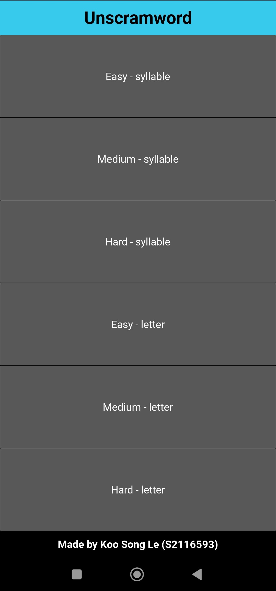
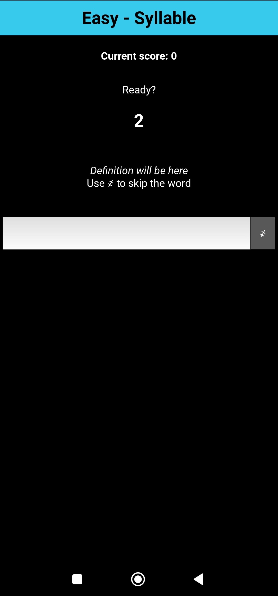
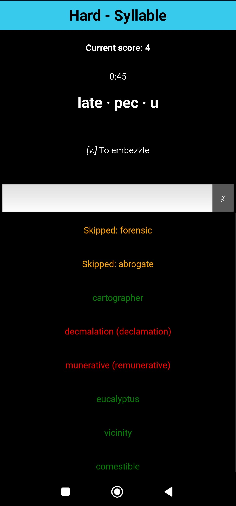
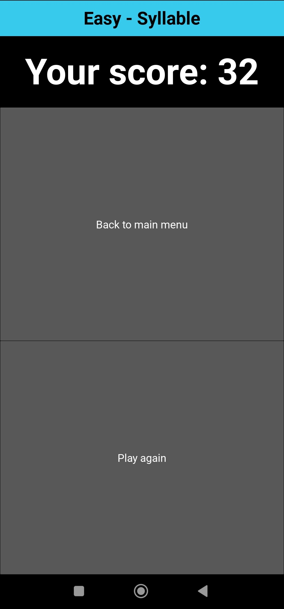

# Unscramword

An educational game developed for Universiti Malaya WIG3005 Game Development course. Built using Python with Kivy framework.

## About game

Introducing our new word-based game Unscramword, a fun and engaging way to boost your vocabulary and challenge your mind. Developed using Python with cross-platform support, our game offers a unique gaming experience that combines strategy, problem-solving, and a love for words. Whether you're a student looking to learn, an adult seeking a mental challenge, or a senior wanting to keep your mind sharp, our game has something for everyone. With its intuitive design and engaging gameplay, our game is not just a game - it's a fun and educational journey through the world of words.

## Showcase






## Download

To download prebuilt game executable, visit the [Release page](https://github.com/NKSL2001/WIG3005-unscramword/releases).

## To build

Requires Python 3.10 and above (`match case` syntax).

Install general dependencies:
```sh
pip install --upgrade pip
pip install -r requirements.txt
```

Windows: Use PyInstaller to build a one-file EXE executable.
```sh
pyinstaller main.spec
```

Android: Use Buildozer to build. On Windows, use WSL2 to build the app in Ubuntu 22.04. Follow the instructions on https://kivy.org/doc/stable/guide/packaging-android.html.
